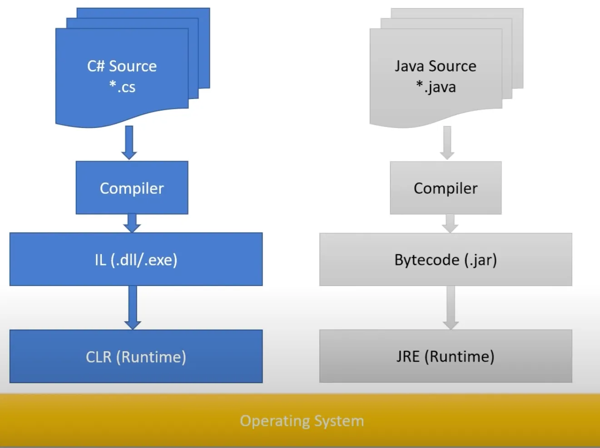
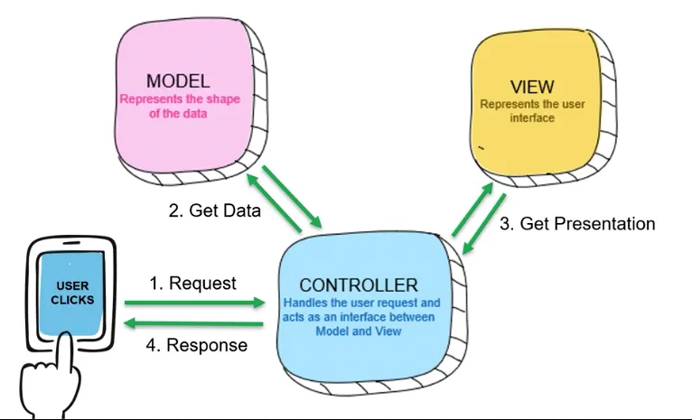
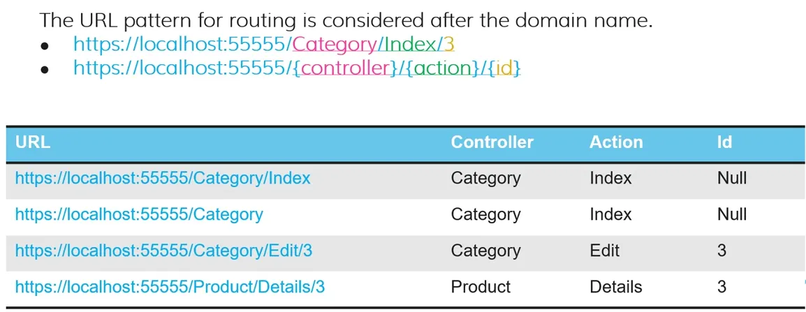

# C#



Can simplify Get/Set methods

```csharp
using System // like import int Java
namespace MyPackage // like package .. in Java

List<int> intList; // Primitives are objects, So can be used like this
int? nullableNumber = 1; // Nullable value, instead of Optional<Integer>

bool exists = false; // boolean in Java
Calculate(ref exists) // we use 'ref' keyword both on using and parameter

public void Calculate(ref bool exists) {} // ref is effective pointer
if (s1 == s2) { ... } // == can be used to company any. Despite .equals() in Java
Console.WriteLine($"Name:{player.Name}, Age: {player.Age}"); // formatted string

class Player {
    public Player(String name, int age)
    {
        this.Name = name;
        this.Age = age;
    }
    public String Name { get; set; } // Simplified get/set methods
    public int Age { get; set; }
}

public static void Main(String[] args) {} // C# uses 'Main' instead of 'main'

int[] numbers = {1,2,3};
SwapNumbers(numbers);
// In C#, function can't modify the passed value.
// We should pass 'ref' to be able to edit
// But in Java objects (not primitives) are modifiable in function

fixed (int* listStart = &list[0]) // 
```

Things like `Length` , `Main`  and function names are uppercase in C#

C# has the following types specifiers alongside `class`, `interface` and `enum`:

- Struct
- Delegate
- Record
- Tuple

In Java, primitives are value types, and objects are reference types. In C# can define manually.

In C# we can define using struct values types, and using class reference types

The way to create a Lambda function:

```java
public interface Func<R,T> {
	public R function (T value);
}
```

```csharp
delegate Result Function<in T, out Result>(T input);
```

C# doesn’t have throw exceptions: `void doIt( ) throws Exception {}`

C# support LINQ (Language Integrated Query) which allows create any type of query against any kind of datasets.

Usage of actual pointers in C#

```csharp
static unsafe void Sort(int[] list)
        {
            bool stillSwapping = true;
            fixed (int* listStart = &list[0]) // get pointer to first element in the list.
            // if we don't use fixed, the address of list may change later. so this listStart
            // will point to nowhere.
            {
                int* listEnd = listStart + list.Length - 1; // Because list items will be in sequence in memory
                while (stillSwapping)
                {
                    stillSwapping = false;
                    for (int* ptr = listStart; ptr < listEnd; ptr++)
                    {
                        int* nextPtr = ptr + 1;
                        if (*ptr > *nextPtr)
                        {
                            SwapValues(ptr, nextPtr);
                            stillSwapping = true;
                        }
                    }
                }
            }
        }
```

## Async programming

- It’s better to add `Async` keyword to the end of Async function names
- The function that has `await`  inside, should be `async`
- If the inner function uses await/async, if the outer caller doesn’t use, our application’s main thread will still blocked.

### Resource

---

[Comparing C# to Java - I Code in Both. Learn about the Differences and Similarities](https://www.youtube.com/watch?v=tHzY_Wur6kw)

# .Net

- `.launchSetting.json`  contains app launch settings like port, SSL, Env Variables, so on
- `appsettings.json` : To store all connection strings and secret keys. like email secrets, database connection strings, API tokens, so on. We can have different versions for each environment, like `appsettings.Production.json`
- Any status code/file that doesn’t have html, will go to `wwwroot`  like any css, js, pdf, images, so on



- In MVC architecture
    - Controller is the brain of our app and most things happen there.
    - View is responsible for representing user interface, like html.
    - When controller received the data from DB in a model format, it’ll pass it to view to convert it to the actual representable UI.
    - Controller can have many action methods.
    - Routing pattern in MVC:



- 
    - Default routing in .Net (We can change it):

```csharp
app.MapControllerRoute(
	name: "default",
	pattern: "{controller=Home}/{action=Index}/{id?}");
// This means, if 'controller' is not defined in the URL, default value is "Home" which will be 
//    'HomeController.cs' file inside 'Controller' folder
//    if 'action' is not defines, set is as Index,
//    but "id" is optional here because of '?' mark.
//    So, main page of our app (like example.com) will handle **HomeController** and for view it will handle
//    **Views/Home/Index** (but we can change this behaviour)
```

- In our Controller, we handle each action using function like this:

```csharp
public class HomeController : Controller {
	public IActionResult Index() {
		return View();
		// If we don't pass view name inside **View()**, .Net will look for view name matches
			// action name. Here will be **Views/Home/Index.cshtml**
	}
	public IActionResult Privacy() {
		return View("GeneralPrivacy"); // This will load **Views/Home/GeneralPrivacy.cshtml**
}
```

- Filename of controllers inside `Controller` directory should follow this pattern: `{Controller}Controller.cs` like `Controllers/HomeController.cs` or `Controllers/GamesContoller.cs` .
    - Views corresponds to the Controller should be within folder without any suffix like `Views/Home` or `Views/Games`
    - We define container in our `program.cs` file, then add services to that container. We define request pipeline as well.
    - Pipeline is the process that requests should follow when comes to our app. Like this:
- Views inside `Views/Shared` folder will be shared between pages of your application.
    - `_Layout.cshtml` file is master page of your app. It’ll be loaded in all our pages. Inside it, there is `@RenderBody()`  . MVC will use it for load each of our views. 
    How the app know it should load `_Layout` file for all pages? We define it in `Views/_ViewStart.cshtml`
- If we want to import something in all our views, add it to `Views/_ViewImports.cshtml`

```csharp
app.UseHttpsRedirection();
app.UseStaticFiles();
app.UseRouting();
app.UseAuthentication();
...
```

- DI (Dependency Injection) is a container that has interfaces instead of actual implementations. Like container which has `IEmail` and `IDb` inside

### Questions to Find Answer

- What is container and service in .Net?
- 

### Entity Framework

- In IDE, write `prop`  for adding new class property
- We can define **PrimaryKey** with adding `[Key]` annotation
- If the class has either `Id` or `{ClassName}Id`  (like `CategoryId`), Entity framework will consider it as PrimaryKey, except if we explicitly define `[Key]` .
- `[Required]` annotation is equivalent to `not null` in DB.